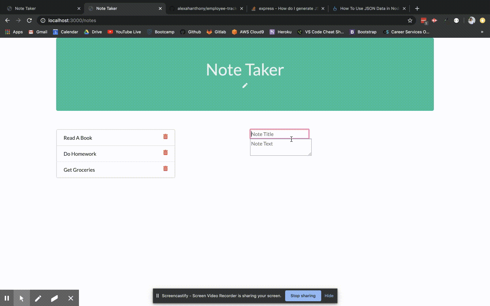
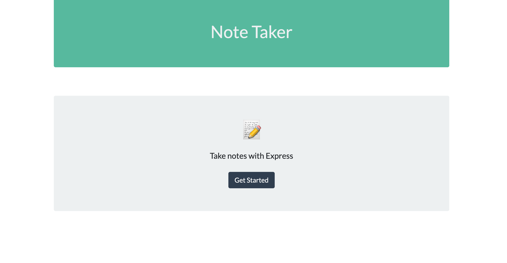
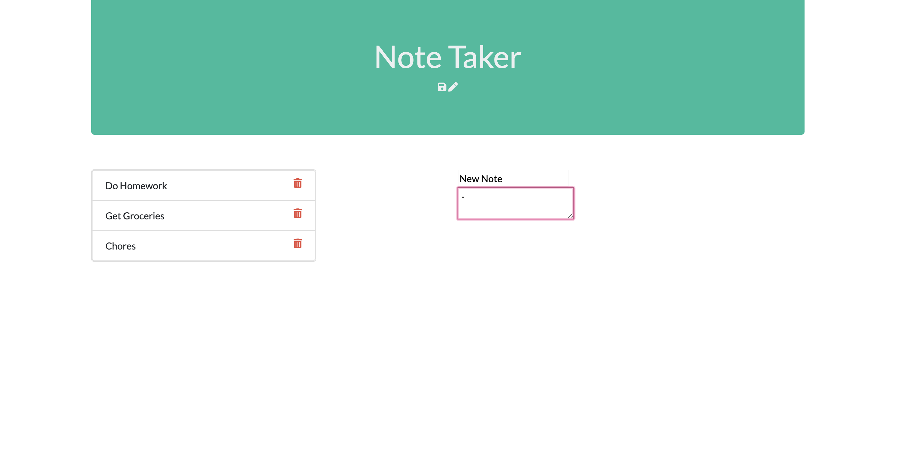

# note-taker app

# Table of Contents (Optional)
N/A

# Installation

View Github Repository. https://github.com/alexahanthony/note-taker-app
View deployed link on Heroku. https://agile-caverns-71451.herokuapp.com/ 

# Usage

This commandline application allows you to make a note, save it for later, and delete completed notes.

# Credits
There were no collaborators, (other than classmates and teacher feedback).

# NPM Packages: 
*  "express": "^4.17.1"

# Third-party assets: 
https://getbootstrap.com/ for styling

https://stackoverflow.com/ for help with syntax

# License
N/A

# Badges
N/A

# Contributing
N/A

# Tests
N/A